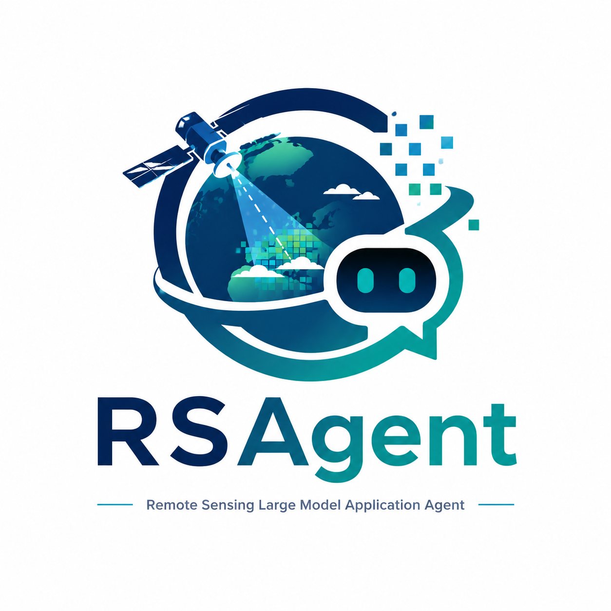
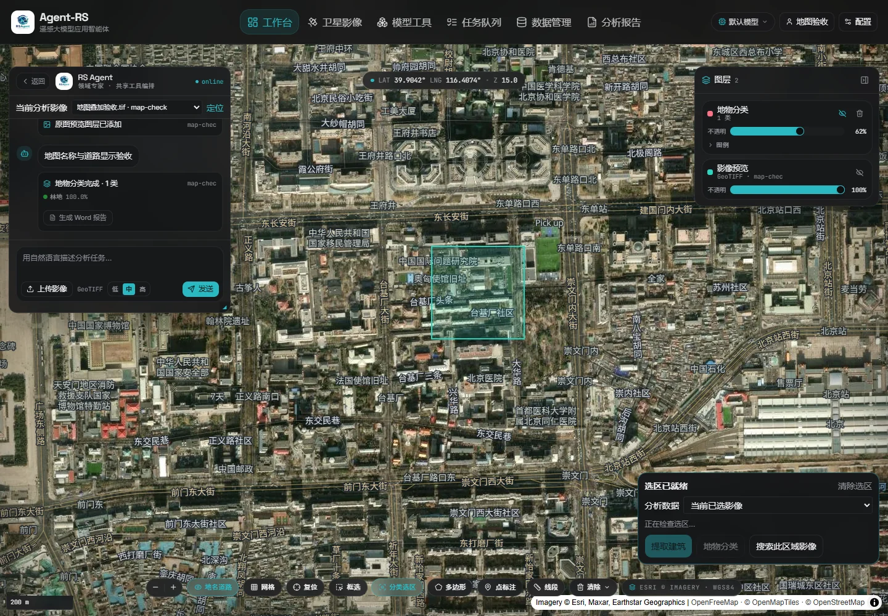
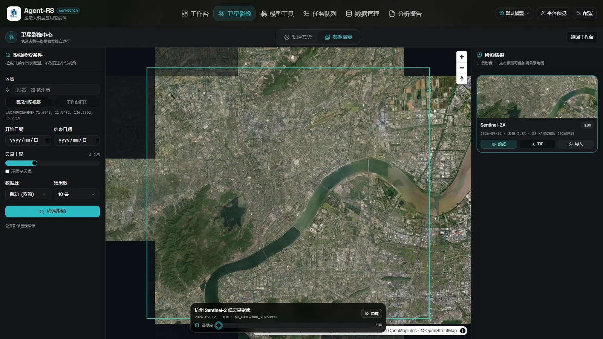
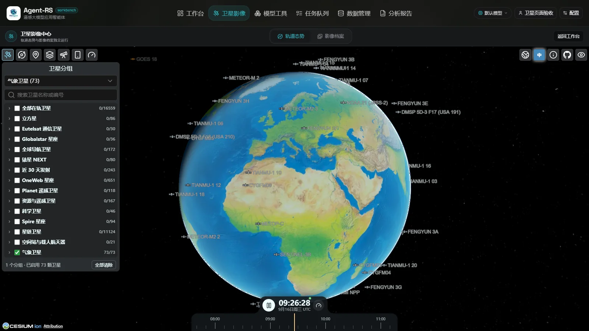

<div align="center">



# Agent-RS

**遥感智能分析与卫星态势平台**

</div>

Agent-RS 将卫星影像、地图框选、遥感分析、卫星轨道态势、知识库和智能对话集中到一个平台。用户可以通过自然语言完成影像检索、目标提取、结果叠加和报告生成。

> 本项目仅允许个人、非商业、本地学习与评估。商业使用、对外提供服务、二次分发及学术发表等用途须事先取得书面许可，完整条款见 [LICENSE](LICENSE)。

## 平台界面

### 智能工作台

在同一张地图中完成影像查看、地名定位、区域框选、自然语言分析和结果图层管理。



### 卫星影像中心

按照区域、时间和云量检索公开卫星影像，并直接预览、下载或导入平台。



### 卫星轨道态势

通过三维地球查看卫星位置和轨道信息，支持卫星分组、中英文切换与卫星图标展示。



## 今日更新（2026-09-16）

本次更新完成了平台一期功能整合，并集中修复影像分析、地图交互、报告生成和卫星态势中的主要问题。

### SAM3 目标提取

- 使用 SAM3 开放词汇实例分割替换旧地物分类模型。
- 支持按“建筑、船舶、车辆、道路、水体”等自然语言概念提取目标。
- 同时生成实例轮廓、目标框、置信度、数量统计和地图叠加结果。
- 支持直接分析地图框选区域，也支持先搜索并导入覆盖该区域的新影像。
- 粗分辨率影像会在推理前提示适用限制，避免输出失真的精细轮廓。

### 卫星轨道态势

- 接入独立的卫星轨道态势工作区，恢复卫星查询、轨道展示和地球视图。
- 修复地球视角偏移、放大后内容被遮挡和页面区域高度不正确的问题。
- 卫星位置由普通圆点升级为卫星图标，并根据轨道类别显示不同颜色。
- 卫星图标会根据观察距离自动调整大小和透明度，密集轨道下仍保持可读性。
- 界面支持中文和英文切换；图标按钮补充功能提示。

### 卫星影像工作区

- 卫星影像作为独立页面展示，检索、预览、下载、导入和档案管理集中在同一页面。
- 影像检索不再跳转到其他工作区或改变当前操作位置。
- 支持 Sentinel-2、Landsat 等公开影像的区域、时间和云量筛选。
- 导入影像后自动设为当前分析影像，Agent、地图和图层面板共享同一选择状态。
- 轨道态势与卫星影像职责分离，避免功能名称和内容重复。

### 地图与图层

- 增加可显示道路、街道、地名和地理名称的地图底图。
- 修复杭州等中文、英文地名无法定位的问题。
- 修复影像预览已加入但被底图遮挡的问题，统一影像、分析结果和框选区域的图层顺序。
- 修复图层显隐、切换影像和更新预览后层级错乱的问题。
- 地图框选后可以直接发起分析，也可以用框选范围检索可用卫星影像。

### 智能对话与报告

- 修复用户消息和执行状态卡片下方出现大块空白的问题。
- 对话框支持调整宽度、高度和整体大小，内容会随面板尺寸自动换行和重排。
- 修复历史恢复内容的异常空白和旧会话响应写入新会话的问题。
- 修复报告服务无法取得当前对话分析结果的问题。
- 报告会使用本次对话中真实保存的分析成果，不再要求用户重复说明上下文。
- 当前影像、地图框选、任务进度和下载成果在对话中保持一致。

### 知识库与知识图谱

- 增加 PostgreSQL 知识库存储和本地 Embedding 服务。
- 支持文档解析、检索和知识图谱展示，可关联文档、片段、工具和 Agent。
- 文档只在与当前问题相关时进入对话上下文，不再每轮无条件注入全部文档。
- 删除文档时同步清理相关片段和图谱关系。

### 界面调整

- 工作台、卫星影像和轨道态势移动到顶部导航栏，与平台标志保持同一高度。
- 优化中英文名称、按钮提示、加载状态和错误说明。
- 分析失败时明确展示真实原因，不再通过重复重试掩盖服务问题。

## 平台能力

| 模块 | 主要功能 |
| --- | --- |
| 智能工作台 | 自然语言遥感分析、任务进度、结果下载、报告生成 |
| 卫星影像 | 公开影像检索、预览、下载、导入和影像档案 |
| 轨道态势 | 卫星查询、轨道可视化、卫星图标、地球视图 |
| 地图分析 | 地名定位、地图框选、当前视野分析、结果图层叠加 |
| SAM3 分割 | 开放词汇目标提取、实例轮廓、数量与面积统计 |
| 遥感工具 | 影像质检、光谱指数、波段组合、目标检测、裁剪和重投影 |
| 知识中心 | 文档管理、相关内容检索、知识图谱和 Agent 关联 |
| 报告中心 | 汇总当前对话中的真实分析结果并生成 Word 报告 |

## 基本使用流程

1. 上传本地 GeoTIFF，或在“卫星影像”页面检索并导入公开影像。
2. 在影像选择器中确认当前分析影像。
3. 在地图上查看整幅影像，或框选需要分析的区域。
4. 用自然语言提出任务，例如“提取框选区域内的建筑和道路”。
5. 在地图查看叠加结果，并下载 GeoTIFF、GeoJSON、预览图或 Word 报告。

## 快速启动

环境要求：Python 3.11+、Node.js 18+、PostgreSQL 和 Docker。

```bash
cp backend/.env.example backend/.env
uv sync --project backend
npm --prefix Agent-frontend ci
npm run dev
```

启动后访问 <http://localhost:5173>。首次运行前需要在 `backend/.env` 中配置数据库、登录密钥和可用的聊天模型。

## 当前验证状态

- 后端测试：1006 项通过，3 项跳过。
- 前端测试：80 项全部通过。
- 前端类型检查与生产构建通过。
- 公网部署、SAM3 服务、影像工作区和卫星轨道态势已完成浏览器验证。

## 相关说明

- [SAM3 分割部署](docs/segmentation-deployment.md)
- [影像与对话交互审查](docs/interaction-audit.md)
- [知识库使用指南](docs/knowledge-guide.md)
- [地图地名与底图说明](docs/map-labels.md)
- [第三方组件与许可证](THIRD_PARTY_NOTICES.md)

## 许可

本仓库采用限制性源码可见许可。除 [LICENSE](LICENSE) 明确允许的个人非商业本地评估外，其他使用均须取得项目权利人的事先书面许可。第三方依赖分别受其原始许可证约束。
